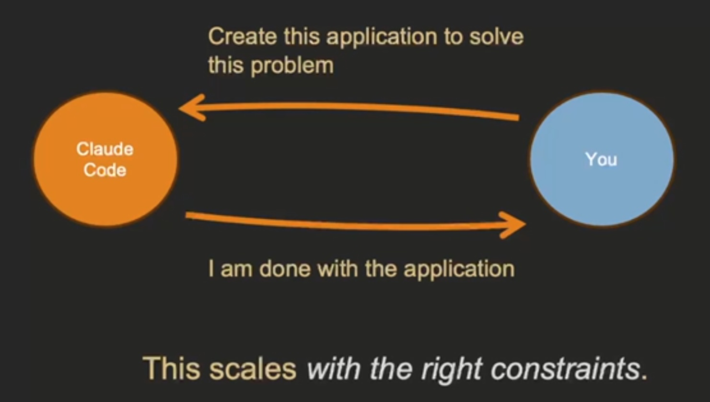

# Module 1 Scaling Up Software Engineering with Claude Code & Generative AI

[Home](README.md) | [Next: Module 2 →](module-2.md)

---

- [1000X Improvement in Software Engineering Productivity with Big Prompts](#1000x-improvement-in-software-engineering-productivity-with-big-prompts)
- [Exercise: Getting Started with Claude Code \& Building Your First Application](#exercise-getting-started-with-claude-code--building-your-first-application)

---

Like having a team of 100 or 1,000 developers

> Write a complete Nextjs + NextUI web application for tracking expenses. When you are done, start it for me to test.

## 1000X Improvement in Software Engineering Productivity with Big Prompts

Stop micromanaging AI by using it to write functions and individual files. By taking the human out of the detailed loop, AI is able to scale up. Give instructions like given to a CPU.

Imagine your manager sitting down and telling you I want you to create a `component/expense_list.tsx`.

> Act like the typical user of this application, then create different ways of sorting, filtering, and displaying the expenses.

Doing the equivalent of zooming out. Human doing higher order critical thinking.

With the model of giving individual tasks like create a function in this file, then "you are the bottleneck. You limit the scalability."

> This will require 100s or more iterations and inputs from you to build an application.



## Exercise: Getting Started with Claude Code & Building Your First Application

```text
I want you to create a modern, professional NextJS expense tracking application.
Here's my vision:

APPLICATION OVERVIEW:
Build a complete expense tracking web app that helps users manage their personal finances.
The app should feel modern, intuitive, and professional.

CORE FEATURES:
- Add expenses with date, amount, category, and description
- View expenses in a clean, organized list
- Filter expenses by date range and category
- Dashboard with spending summaries and basic analytics
- Categories: Food, Transportation, Entertainment, Shopping, Bills, Other
- Data persistence using localStorage for this demo

TECHNICAL REQUIREMENTS:
- NextJS 14 with App Router
- TypeScript for type safety
- Tailwind CSS for styling with a modern, clean design
- Responsive design that works on desktop and mobile
- Use React hooks for state management
- Form validation for expense inputs
- Date picker for expense dates
- Currency formatting for amounts

DESIGN REQUIREMENTS:
- Clean, modern interface with a professional color scheme
- Intuitive navigation and user experience
- Visual feedback for user actions
- Loading states and error handling
- Mobile-responsive design

SPECIFIC FUNCTIONALITY:
- Expense form with validation
- Expense list with search and filter capabilities
- Summary cards showing total spending, monthly spending, top categories
- Basic charts or visual representations of spending patterns
- Export functionality (at least CSV)
- Delete and edit existing expenses

Please create this as a complete, production-ready application.
Set up the project structure, implement all features,
and make sure everything works together seamlessly.
Focus on creating something that looks professional
and that I could actually use to track my expenses.

When you're done, provide instructions on
how to run the application and test all features.
```

"AI as labor, Not Just a Tool"

---

[Home](README.md) | [Next: Module 2 →](module-2.md)
