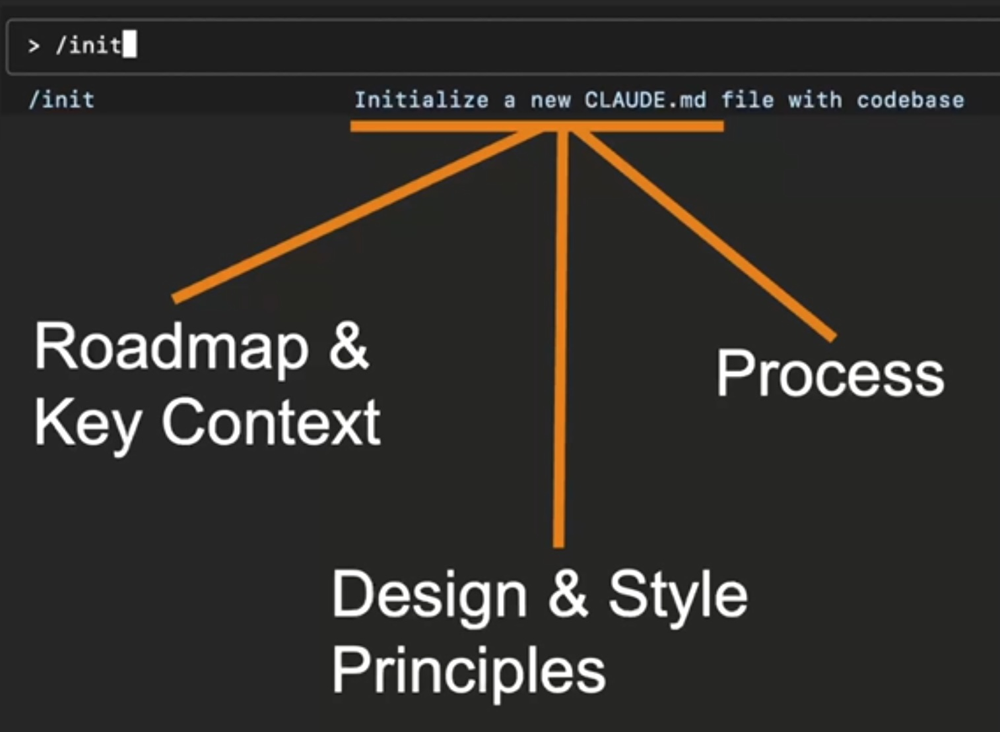

# Module 4 Building Process & Context in Claude Code

[Home](README.md) | [← Previous: Module 3](module-3.md) | [Next: Module 5 →](module-5.md)


---

- [Global Persistent Context: `CLAUDE.md`](#global-persistent-context-claudemd)
- [Writing CLAUDE.md Files](#writing-claudemd-files)
- [Reusable Targeted Context \& Process: Claude Code Commands](#reusable-targeted-context--process-claude-code-commands)
- [Creating Claude Commands](#creating-claude-commands)
- [In-Context Learning: Teaching with Examples](#in-context-learning-teaching-with-examples)
- [Exercise: Building a Documentation Generator](#exercise-building-a-documentation-generator)

---

## Global Persistent Context: `CLAUDE.md`

Like a new team member, you have to onboard Claude to be able to read documents, code, style guides, to be able to write code following the conventions of the organization. It needs a huge amount of context.

"Context is what we use to give specificity to our instructions." A more specific target to hit.

Compare

Less context

```text
Write an app for tracking expenses.
```

More Context

```text
Write a NextJs Web app that uses NextUI
for tracking expenses.
```

We don't want to micromanage, but we have to balance how much context we give it to get what we want.

`/init` initialize CLAUDE.md file, but you'll want to add context to the file. Such as SOLID principles or functional programming.



Steer it in the right direction. Like if you want it to use SOLID principles, you can add something like this to the file.

```md
Whenever you write object-oriented code, it MUST follow the SOLID design principles. Never write OO code that violates these principles. If you do, you will be asked to refactor it.
```

We don't want thousands of lines in the `CLAUDE.md` file. Should only be essential information. Institutional memory for every single prompt. Not the right place for all context.

## [Writing CLAUDE.md Files](https://www.coursera.org/learn/claude-code/supplement/vxmYz/writing-claude-md-files)

> The CONTEXT Framework for Claude.md Design
Use this acronym to remember the key principles:

* **C**lear and Concise Instructions
* **O**perational Processes
* **N**aming and Standards
* **T**esting and Quality Gates
* **E**xamples and References
* **X**pectations and Boundaries
* **T**ools and Dependencies

<details>
<summary>Example 1: Web Application Development Team</summary>

```md
# Project: TaskFlow Web Application

## Core Principles
**IMPORTANT**: Whenever you write code, it MUST follow SOLID design principles. Never write code that violates these principles. If you do, you will be asked to refactor it.

## Development Workflow
1. Before making any changes, create and checkout a feature branch named `feature-[brief-description]`
2. Write comprehensive tests for all new functionality
3. Compile code and run all tests before committing
4. Write detailed commit messages explaining the changes and rationale
5. Commit all changes to the feature branch

## Architecture Overview
- **Frontend**: Next.js 14 with TypeScript and Tailwind CSS
- **State Management**: Zustand for client state, React Query for server state
- **Backend**: Node.js with Express and Prisma ORM
- **Database**: PostgreSQL
- **Testing**: Jest for unit tests, Playwright for E2E

## Code Standards
- Use TypeScript for all new code with strict type checking
- Follow the existing component structure in `/src/components`
- API routes follow RESTful conventions in `/src/pages/api`
- Use Prisma schema definitions for all database operations
- CSS classes should use Tailwind utilities; custom CSS only when necessary

## Quality Gates
- All code must compile without warnings
- Test coverage must remain above 80%
- All tests must pass before committing
- ESLint and Prettier must pass without errors

## File Organization
- Components: `/src/components/[feature]/[ComponentName].tsx`
- Pages: `/src/pages/[route].tsx`
- Utilities: `/src/lib/[category]/[utility].ts`
- Types: `/src/types/[domain].ts`
```

</details>


<details>
<summary>Example 2: Python Data Science Project</summary>

```md
# Project: Customer Analytics Pipeline

## Development Standards
- **Language**: Python 3.11+
- **Code Style**: Follow PEP 8 strictly, use Black for formatting
- **Type Hints**: Required for all function signatures and class definitions
- **Documentation**: Docstrings required for all public functions and classes

## Workflow Requirements
1. Create feature branch: `analysis-[description]` or `model-[description]`
2. Write unit tests for all data processing functions
3. Run `pytest` and ensure all tests pass
4. Run `black .` and `flake8` before committing
5. Update relevant documentation in `/docs` if adding new features

## Project Structure
- `/src/data`: Data ingestion and preprocessing modules
- `/src/models`: ML model definitions and training scripts
- `/src/analysis`: Exploratory analysis notebooks and scripts
- `/src/utils`: Shared utility functions
- `/tests`: Comprehensive test suite
- `/configs`: Configuration files for different environments

## Data Handling Standards
- Use Pandas for data manipulation, prefer vectorized operations
- All data files must be documented in `/data/README.md`
- Use Pydantic models for data validation and serialization
- Never commit raw data files to version control
- Use environment variables for database connections and API keys

## ML/Analysis Guidelines
- Use scikit-learn for standard ML algorithms
- Notebook naming: `YYYY-MM-DD-[initials]-[description].ipynb`
- Save all trained models with versioning in `/models/trained`
- Use MLflow for experiment tracking
- Include model performance metrics in commit messages

## Dependencies
- Core: pandas, numpy, scikit-learn, matplotlib, seaborn
- ML: xgboost, lightgbm, optuna
- Data: sqlalchemy, pydantic, requests
- Testing: pytest, pytest-cov
```

</details>


<details>
<summary>Example 5: DevOps Infrastructure Project</summary>

```md
# Project: Multi-Cloud Infrastructure Platform

## Infrastructure as Code Standards
- **Primary Tool**: Terraform with HCL
- **Cloud Providers**: AWS, Azure, GCP
- **Configuration Management**: Ansible playbooks
- **Container Orchestration**: Kubernetes with Helm charts
- **Monitoring**: Prometheus, Grafana, ELK stack

## Workflow Requirements
1. Create infrastructure branch: `infra-[environment]-[component]`
2. Run `terraform plan` and review changes carefully
3. Test in development environment first
4. Update documentation in `/docs/runbooks`
5. Peer review required for production changes
6. Use conventional commits with clear impact description

## Directory Structure
- `/terraform/[provider]/[environment]/`: Environment-specific configurations
- `/ansible/playbooks/`: Configuration management scripts
- `/k8s/[namespace]/`: Kubernetes manifests and Helm charts
- `/scripts/`: Automation and deployment scripts
- `/docs/`: Architecture decisions and runbooks

## Security and Compliance
- All secrets must use external secret management (AWS Secrets Manager, etc.)
- Enable encryption at rest and in transit for all data stores
- Implement least-privilege access policies
- Use service accounts, never personal credentials in automation
- Maintain audit logs for all infrastructure changes

## Deployment Principles
- Use blue-green deployments for zero-downtime updates
- Implement automatic rollback on health check failures
- Tag all resources with environment, owner, and cost-center
- Use infrastructure modules for reusability across environments
- Implement proper backup and disaster recovery procedures

## Monitoring and Alerting
- Set up alerts for resource utilization > 80%
- Monitor certificate expiration dates
- Track deployment success/failure rates
- Implement SLA monitoring for critical services
- Use runbooks for common incident response procedures

## Cost Optimization
- Implement auto-scaling policies for dynamic workloads
- Use spot instances where appropriate for non-critical workloads
- Regular cost reviews with resource rightsizing
- Implement resource lifecycle policies for cleanup
```

</details>


<details>
<summary>Example 6: Open Source Library Development</summary>

```md
# Project: DataValidator - Python Data Validation Library

## Library Design Principles
- **API Design**: Simple, intuitive, and Pythonic
- **Dependencies**: Minimal external dependencies
- **Compatibility**: Python 3.8+ support
- **Performance**: Optimize for speed and memory efficiency
- **Documentation**: Comprehensive with examples

## Development Workflow
1. Create feature branch: `feature-[functionality]` or `fix-[issue-number]`
2. Write tests first (TDD approach)
3. Ensure 100% test coverage for new code
4. Update documentation and examples
5. Run full test suite across Python versions: `tox`
6. Update CHANGELOG.md with clear user-facing description

## Code Quality Standards
- Follow PEP 8 with line length limit of 88 characters
- Use type hints for all public APIs
- Docstrings required for all public functions/classes (Google style)
- Use dataclasses or Pydantic for structured data
- Implement proper error handling with custom exceptions

## Project Structure
- `/src/datavalidator/`: Main library code
- `/tests/`: Comprehensive test suite
- `/docs/`: Sphinx documentation
- `/examples/`: Usage examples and tutorials
- `/benchmarks/`: Performance testing scripts

## Testing Requirements
- Unit tests with pytest for all functionality
- Property-based testing with Hypothesis for edge cases
- Performance benchmarks for critical paths
- Integration tests with popular data libraries (pandas, numpy)
- Test matrix: Python 3.8, 3.9, 3.10, 3.11, 3.12

## Documentation Standards
- README with quick start guide and installation
- API documentation generated from docstrings
- Tutorial notebooks for common use cases
- Performance guidelines and best practices
- Migration guides for major version changes

## Release Process
- Semantic versioning (MAJOR.MINOR.PATCH)
- Automated testing on multiple Python versions
- Code coverage reports and quality metrics
- Security scanning for vulnerabilities
- Automated PyPI releases via GitHub Actions

## Community Guidelines
- Welcome contributions with clear CONTRIBUTING.md
- Issue templates for bugs and feature requests
- Code of conduct for inclusive community
- Regular maintenance and dependency updates
- Responsive to community feedback and issues
```
</details>

> The goal is to scale your AI development labor by providing the right context at the right level - enough specificity to get what you want, but not so much constraint that it can't innovate within your boundaries.

## Reusable Targeted Context & Process: Claude Code Commands

Repeat something over and over in the same way with important context. Can add command.md files.

`.claude/commands/code_review.md`

Can use `$ARGUMENTS` and templates, like `<file_name>.review.md`.

Reusable prompts with targeted context piped in and targeted process.

Ask Claude to look at project and generate useful commands.

## [Creating Claude Commands](https://www.coursera.org/learn/claude-code/supplement/xLRqn/creating-claude-commands)

> Commands transform Claude Code from a general assistant into a specialized team member with deep knowledge of your specific workflows. They ensure consistent, high-quality execution of repetitive tasks while providing the targeted context needed for complex operations.

> The TARGETED Framework for Command Design
Use this acronym to create effective commands:

* Task-Specific Instructions
* Arguments and Placeholders
* Reusable Process Steps
* Guided Examples and References
* Explicit Output Requirements
* Template-Based Naming
* Error Handling and Edge Cases
* Documentation and Context

<details>
<summary>Example 2: API Test</summary>

File: `.claude/commands/api-test`

```md
# API Testing Command

Create comprehensive API tests for: $ARGUMENTS

## Testing Strategy
Test the following API endpoints and scenarios based on $ARGUMENTS:

1. **Happy Path Testing**:
   - Valid request formats
   - Expected response structures
   - Proper HTTP status codes

2. **Error Handling Testing**:
   - Invalid request payloads
   - Authentication failures
   - Authorization edge cases
   - Rate limiting scenarios

3. **Edge Cases**:
   - Boundary value testing
   - Large payload handling
   - Concurrent request handling
   - Network timeout scenarios

## Test Structure Template
Create tests in `/tests/api/{endpoint-name}.test.ts`:

```typescript
describe('{Endpoint Name} API', () => {
  describe('POST /{endpoint}', () => {
    it('should create {resource} with valid data', async () => {
      // Test implementation
    });

    it('should return 400 for invalid data', async () => {
      // Test implementation
    });

    it('should require authentication', async () => {
      // Test implementation
    });
  });

  describe('GET /{endpoint}', () => {
    // Additional test cases
  });
});
```

</details>

## In-Context Learning: Teaching with Examples

> ...one of the most important and powerful things that we do is we teach through example. We show examples of good code, what we want things to look like. We don't necessarily explain every last detail of why that's beautiful code or why it's what we want, but we show lots of great examples.

## Exercise: Building a Documentation Generator


---

[Home](README.md) | [← Previous: Module 3](module-3.md) | [Next: Module 5 →](module-5.md)
