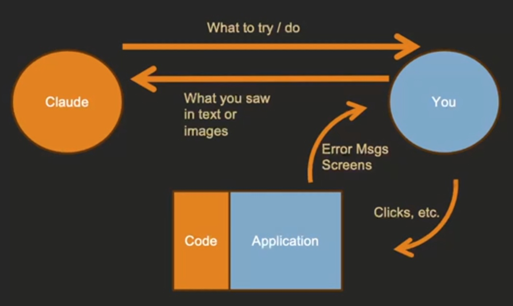
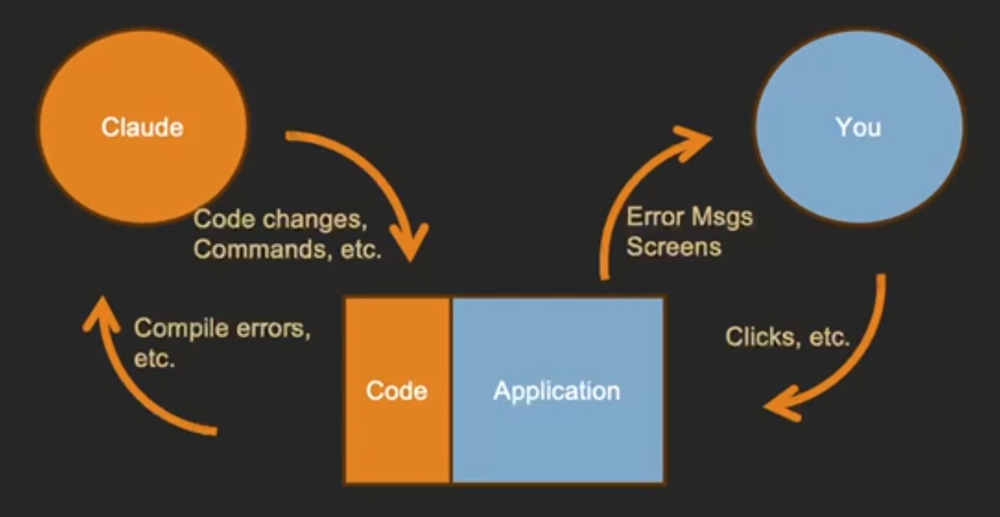
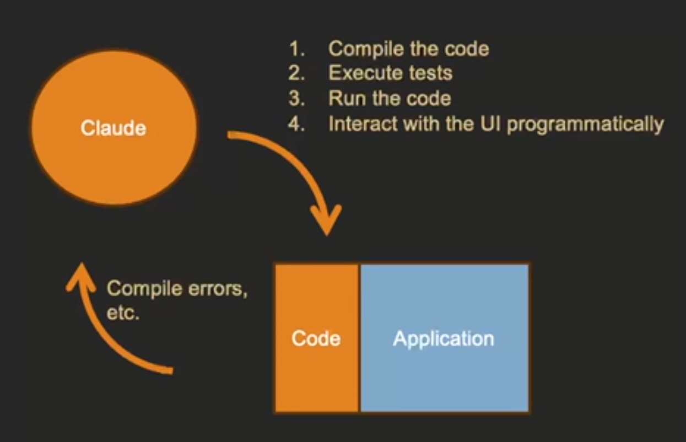

# Module 6 Improving Claude Code Scalability & Reasoning

[Home](README.md) | [← Previous: Module 5](module-5.md) | [Next: Module 7 →](module-7.md)

---

## Being Claude Code's Hands, Eyes, and Ears

> I think of software engineering as a search process...I'm trying to change my code to improve some outcome...One of the key things I have to do is I have to get feedback on what happened.

Because it may not do this, you have to tell Claude Code to

* compile the code
* run the tests

You want to limit the amount of work that you have to do to decide if what it did was good or not.

Somethings that we can't automate or specify, like user interfaces, we want to be Claude Code's hands, eyes, and ears. Give it feedback on what went wrong or what changes you want to make, such as screenshots, console error messages with context of when error showed up.



We want to limit the amount of this interaction as it's a bottleneck to scalability.



## Ensuring Claude Code Checks Its Own Work

Add to [CLAUDE.md](CLAUDE.md)

```md
# IMPORTANT

1. Before you make any change, create and check out a feature branch named "feature-some-short-name". Make and then commit your changes in this branch.

2. You must write automated tests for all code.

3. You must compile the code and pass ALL tests and linting before committing.
```



## AI Labor Scalability: Software Design, Token Limits, and Maintainability

Single responsibility, minimal changes, prevent ripple effects. Smaller files easier for AI to grok and to fit within the token limit.

### Token limits on input & output

AI Model like a lens (flashlight gm) moving around and exploring to figure out what it needs to change.

Large files and thousands of smaller files with many dependencies make it harder for humans to grok and for AI to stay under token limits. We need to think about design and instruct AI "to write code that will make it maintainable in the long term and scalable for AI labor to work on in the long term."

Translate design skills into rules and processes for the AI labor to follow.

## Having Claude Code Think & Plan First

> This "think first, code second" approach is particularly valuable for complex features, architectural decisions, and integration challenges where the cost of rework is high and the benefits of proper planning are substantial.

You can save the plan to a file and edit/add additional constraints, such as `FEATURE_PLAN.md` or `INTEGRATION_DESIGN.md`. Paper trail of design decisions and reasoning. Useful for onboarding humans and AI to codebase.

> It is MUCH faster to point out a mistake in Claude Code's plan and have it fix the plan than it is to try and undo poor implementation decisions made on the fly.

Claude thinking levels
* think
* think hard
* think harder
* ultrathink

Sample plan

```md
Think hard about how to implement
a machine learning-powered
expense categorization system that learns
from user behavior and suggests
categories automatically.

1. What are the core technical challenges?
2. What data do we need to collect and how?
3. What ML approaches would work best for this problem?
4. How should we handle privacy and data security?
5. What's the user experience flow?
6. How do we handle edge cases and errors?
7. What's the deployment and maintenance strategy?

Provide a comprehensive technical analysis before we start coding.
Save the plan to development_plan.txt
```

## Project Structure and File Naming is Critical Context for Claude Code Scalability

Same for onboarding new engineers. Ask to create project structure obvious and clear from the top level will reduce the amount of files they have to look through. Provide rich context and common naming conventions (that it was trained on) so as to provide less documentation on how things are laid out.

Helps Claude to figure out where to make changes without having to dive into the details -> thinking/token efficient. gm: `ls` vs `cat`. Structure matches prompts -> token efficient (less cost), faster, more likely to do the right thing (on its own), reduces human interaction -> more scalable.


---

[Home](README.md) | [← Previous: Module 5](module-5.md) | [Next: Module 7 →](module-7.md)
